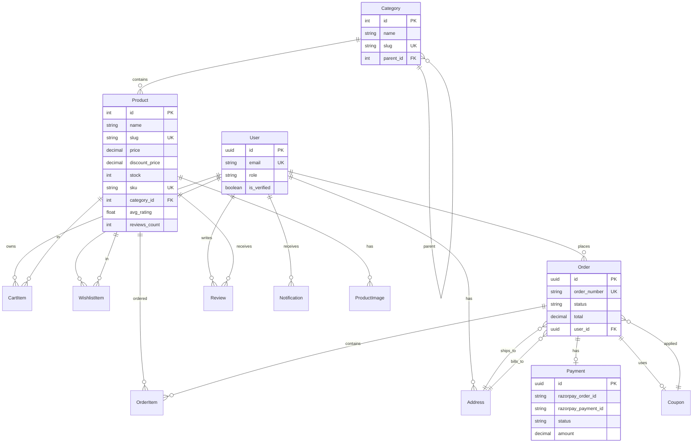

# GoCart — Database Design

## ER Diagram



## Relationships

| Parent | Child | Type | On Delete |
|--------|-------|------|-----------|
| User | Address | 1:N | CASCADE |
| User | CartItem | 1:N | CASCADE |
| User | Order | 1:N | PROTECT |
| Category | Category | self-ref | CASCADE |
| Category | Product | 1:N | PROTECT |
| Product | ProductImage | 1:N | CASCADE |
| Product | Review | 1:N | CASCADE |
| Order | OrderItem | 1:N | CASCADE |
| Order | Payment | 1:1 | CASCADE |

## Indexing Strategy

```sql
-- Products: search & filter
CREATE INDEX idx_product_category ON products(category_id);
CREATE INDEX idx_product_active_featured ON products(is_active, is_featured);
CREATE INDEX idx_product_slug ON products(slug);
CREATE INDEX idx_product_sku ON products(sku);
CREATE INDEX idx_product_price ON products(price);

-- Orders: user history & admin analytics
CREATE INDEX idx_order_user_status ON orders(user_id, status);
CREATE INDEX idx_order_created ON orders(created_at DESC);
CREATE INDEX idx_order_number ON orders(order_number);

-- Reviews: product aggregation
CREATE INDEX idx_review_product ON reviews(product_id);
CREATE UNIQUE INDEX idx_review_user_product ON reviews(user_id, product_id);

-- Cart: fast lookup
CREATE UNIQUE INDEX idx_cart_user_product ON cart_items(user_id, product_id);

-- Categories: tree traversal
CREATE INDEX idx_category_parent ON categories(parent_id);
CREATE INDEX idx_category_slug ON categories(slug);
```

## Query Optimization

1. **Product listing**: `select_related('category')` + `prefetch_related('images')`
2. **Order details**: `prefetch_related('items__product')`
3. **Admin dashboard**: Aggregate queries with `annotate()` + `values()` — avoid N+1
4. **Featured products**: Redis cache, invalidated on save
5. **Review ratings**: Denormalized `avg_rating` / `reviews_count` on Product, updated via signals
